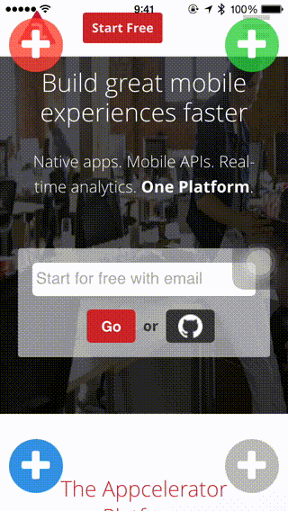

# ti-fab

Floating Action Button for Titanium Alloy Widget. Looks like [futuresimple / android-floating-action-button](https://github.com/futuresimple/android-floating-action-button).




## Install

Download from [releases](https://github.com/k0sukey/be.k0suke.tifab/releases) page.

## Usage

**Controller**

```javascript
function doItemclick(e) {
	console.log(e);
}

function doToggle(e) {
	console.log(e);
}

$.index.open();
```

**View**

```xml
<Alloy>
	<Window>
		<Widget src="be.k0suke.tifab" id="fab" onToggle="doToggle" onItemclick="doItemclick"/>
	</Window>
</Alloy>
```

**Style**

```javascript
'#fab': {
	top: 20,
	right: 10,
	width: 60,
	height: 60,
	backgroundColor: '#cc2ecc40',
	focusedColor: '#ff3d9970',
	borderWidth: 1,
	borderColor: '#ececec',
	title: '\uf067',
	font: {
		fontFamily: 'FontAwesome',
		fontSize: 40
	},
	color: '#ffffff',
	rotation: true,
	direction: 'left',
	items: [
		{
			backgroundColor: '#2ecc40',
			focusedColor: '#3d9970',
			title: '\uf080',
			font: {
				fontFamily: 'FontAwesome',
				fontSize: 40
			},
			color: '#ffffff'
		},
		{
			backgroundColor: '#2ecc40',
			focusedColor: '#3d9970',
			title: '\uf201',
			font: {
				fontFamily: 'FontAwesome',
				fontSize: 40
			},
			color: '#ffffff'
		},
		{
			backgroundColor: '#2ecc40',
			focusedColor: '#3d9970',
			title: '\uf200',
			font: {
				fontFamily: 'FontAwesome',
				fontSize: 40
			},
			color: '#ffffff'
		}
	]
}
```

## ToDo

* Drop shadow
* Tooltip

## License

MIT